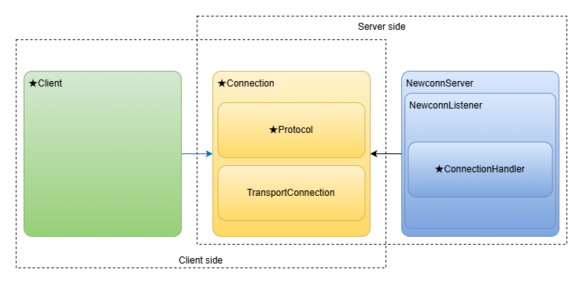

# Mamemaki.Newconn

**Mamemaki.Newconn** is a library for building reliable and high-performance TCP servers and clients for your own protocol.

It includes the following features:

- Protocol implementation
  - Abstraction enables the quick and easy implementation of any proprietary protocol
  - **You can use your own connection class**, which will allow you to use your custom protocol naturally
- Features that can be extended as middlewares
  - TLS
  - MaxConcurrentConnectionLimit
  - Idle connections timeout
  - Data sniffing for debugging
  - Connection ID issuance
  - Heartbeats
- Performance
  - Based on the [Kestrel](https://learn.microsoft.com/aspnet/core/fundamentals/servers/kestrel) socket connection implementation, which is the fastest c# web server
  - Efficient handling of buffer management, backpressure and flow control via [System.IO.Pipelines](https://learn.microsoft.com/dotnet/standard/io/pipelines)
  - Efficient asynchronous processing and cancellation via TAP(Task-based Asynchronous Pattern)
- [DI(Dependency Injection)](https://learn.microsoft.com/dotnet/core/extensions/dependency-injection/) support
- Diagnostics
  - Logging support by [Microsoft.Extensions.Logging](https://learn.microsoft.com/dotnet/core/extensions/logging)
  - Metrics collection support by [System.Diagnostics.Metrics](https://learn.microsoft.com/dotnet/core/diagnostics/metrics)

## Key components

\* Star sign indicates the classes/methods that you need to implement.

- **★Client**: This is a client class. It is just a wrapper of the connection. You whould implement your own client class by inheriting from this class. Using this class is optional. You can use the Connection class directly or via the client class. **This class can be instantiated via Dependency Injection**. This means that you can use DI services like DBContext within it. You can define business layer methods such as AuthenticateAsync in it.
- **★Connection**: This class represents a connection. You will implement your own connection class by inheriting from this class. **This class can only be instantiated by parameterless constructor**. Within the class, you can send or receive your protocol messages by using your protocol class. Additionally, **the connection class will be shared between Server and Client**. This means that you can define common methods for both sides.
- **★Protocol**: This is your protocol definition class. It handles the encoding and decoding of your protocol messages from the raw transfer data. This class is stateless. If you use the raw transfer data as-is, you do not need to implement it.
- **TransportConnection**: This class implements actual transfer processing, such as socket handling. Users would not usually use this class directly.
- **NewconnServer**: This is the server class. It manages all listeners and global settings.
- **NewconnListener**: This is a listener class. It accepts connections from endpoints, dispatches connection handlers, and manages accepted connection resources.
- **★ConnectionHandler**: This is a connection handler method/class. You will implement the processing for the accepted connection. You can define business layer methods such as AuthenticateAsync in it.

## Documentation

- [Implementation Guide](ImplementationGuide.md)

## Benchmark
| Method | Framework   | Mean     | Error    | StdDev   | Allocated |
|------- |------------ |---------:|---------:|---------:|----------:|
| Run    | Kestrel     | 60.80 ms | 0.202 ms | 0.179 ms |   1.88 MB |
| Run    | Newconn     | 60.79 ms | 0.214 ms | 0.190 ms |   1.88 MB |
| Run    | SuperSocket | 65.75 ms | 0.502 ms | 0.469 ms |   8.02 MB |

See the [Benchmarks](Benchmarks/README.md) for details.

## Special thanks
This project is based on [Kestrel](https://learn.microsoft.com/aspnet/core/fundamentals/servers/kestrel) and inspired following projects:

- [BedrockFramework](https://github.com/davidfowl/BedrockFramework)
- [SuperSocket](https://github.com/kerryjiang/SuperSocket)
- [Pipelines.Sockets.Unofficial](https://github.com/mgravell/Pipelines.Sockets.Unofficial)
- [System.Net.Connections](https://github.com/dotnet/runtime/issues/1793)
